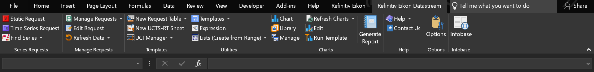
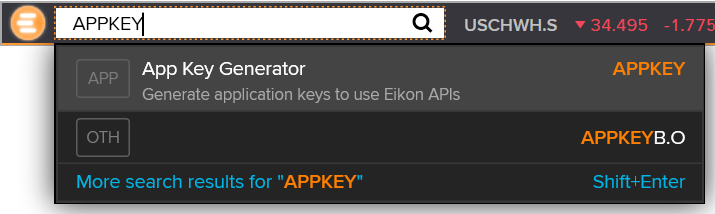
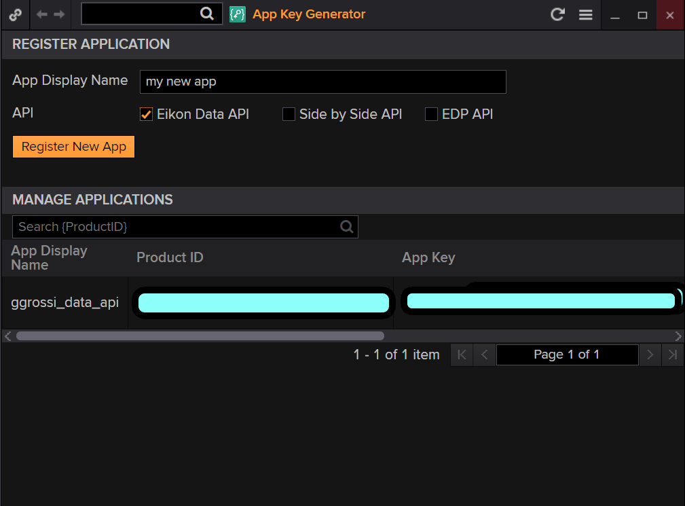

# The Eikon API

# Getting Started with Python Eikon

## Introduction

The first logical step of each application is always direclty linked to the question: 'Where do I get my data?'. 
Financial Data is very etherogenous and comes from different sources, may it be a financial statement of a company or the price of a particular security. It also has different formats, from csv files to live streams of data.

Taking in consideration every source of data is prohibitive for a guide. I will therefore focus on some key methodologies and a couple of different data providers and I hope I will cover a good range of situations, so that everybody can apply and adapt these concepts to the particular case at hand without big traumas.

The two most famous data providers on the market are Reuters and Bloomberg. I will not comment on their characteristics and which one has better quality service or better price. I imagine that each institution makes the decision based on different aspects: from a purely budgetal point of view to availabiliy of certain data figures or to the frequency of requests. Is up to you to decide which provider better fits your need and act accordingly.

I mainly use Eikon terminal, that is the application for Reuters data streaming. I also use Bloomberg for certain type of data we need, but less often. This is the reason why I will start speaking about Eikon terminal, its integration in Excel and how to retrieve the same data using Python. 

## Two types of data

Before jumping on the
subject it is maybe useful to make a distinction between the main two types of data you can retrieve from these providers:

1. **Live data:** this type of data always refers to the latest data available for a particular instrument. There is a timestamp attached to the quote. It is used mainly for live monitoring of the financial market and live/algo trading. 
2. **Historical data:** this type of data refers to all the records for a certain interval of time. There are different frequencies of sampling available, i.e. daily, hourly, 10 minutes etc. It is used mainly for backtesting, model training and the calculation of metrics/indicators.

## The Eikon Excel interface

Connection with Eikon in Excel is made via a dynamic (.dll) library that is installed on the system togeteher with the desktop application. The integration is therefore very easy and the functionalities for Excel come shipped with the whole package. Very handy!

Once Excel is opened, the add-in buttons are accessible via the ribbon.


I'm not going to explain the functionalities of all the buttons but there are a couple of takeways and features to underline:

1. Connection is made under the hood via the Connect button.
2. There is a button to start/stop the data stream.
3. There is a button to refresh all the formulas.

Historical data can be obtained by using a service called 'Datastream'. There is another panel on the Ribbon to access it.



Also in this case there are different buttons. The buttons on the left will open a GUI with different features. Some takeways:

1. You can browse the GUI to find what you're looking for
2. You can build the requests via the interface.
3. You can manage your requests, change the symbols and time frame of the data you are pulling.

Once the request is constructed, Datastream will dump the time-series in a spreadsheet using a custom formula with codes.

If you know the codes and the formulas, you can directly type them in a blank cell and the result will be the same. Live data work in the same way: There is a code for every financial instrument called 'RIC', and the Live data can be accessed by typing a custom formula.

Here is an example of Excel Formula for Live data:


while here is an example of Datstream formula:


These features help in building a nice framework to work with Excel. In fact, a lot of Excel applications in Finance are constructed on top of Eikon. There are some drawbacks in my opinion by the way:
1. both of the interfaces (for live and historical data) are counter-intuitive and hard to navigate. 
2. Formula for the datastream request are somewhat cryptic and hard to construct.
3. The instrument codes for live data and Datastream are different! 😡

Let's see how can we retreive the same information using Python, istead of the Excel add-in. 

## Setting up ann App key

There is code you can tap in the Eikon bar search bar: 'APPKEY'



And register a new app with a custom name



you will be given a long string of numbers and alphas that you will need after, in order to connect from Python. As you can see I have already done that for a my development projects.

## Install the python library

Another easy step to accomplish. From a terminal run the command:
```
pip install eikon
```
The python package is now ready to use. We can move on the fun part! &#127881; &#127881; &#127881;

# Retrieve Live Data for a specific Instrument

It's now time to get the actual data from the API. We start by trying to obtain the last price for the most famous of the market indexes, The S&P500. First we need to import the eikon api and pass the string we generated in the previous section using the method ```set_app_key```. 


```python
import eikon
eikon.set_app_key('your api key here')
```

Secondly, we obtain the last price using the method ```get_data```. The method accepts two inputs:

1. a list of strings with the codes of the instruments we need to retrieve (S&P500,APPL etc.).
2. the names of the fields we need (i.e. last, bid, ask etc.).

it returns a 2-tuplewith a pandas DataFrame and an error message (if any). 


```python
df,e = eikon.get_data(['.SPX','AAPL.O'],['CF_LAST','CF_BID'])
msg = f'the following error has been produced {e}' if e else 'No errors have been produced' 
print(msg)
```

    No errors have been produced
    

We print the error is any, otherwise we can have a look at the DataFrame.


```python
df
```


<div>
<table border="1" class="dataframe">
  <thead>
    <tr style="text-align: right;">
      <th></th>
      <th>Instrument</th>
      <th>CF_LAST</th>
      <th>CF_BID</th>
    </tr>
  </thead>
  <tbody>
    <tr>
      <th>0</th>
      <td>.SPX</td>
      <td>4326.51</td>
      <td>4285.59</td>
    </tr>
    <tr>
      <th>1</th>
      <td>AAPL.O</td>
      <td>159.22</td>
      <td>166.3</td>
    </tr>
  </tbody>
</table>
</div>


Fantastic! &#128170;
This is a very first step to reach your Python idependence! Setting up your environment and getting your data is already a very big step forward. I am tempted to make a quote here:

> A small step for a developer, a big step for humanity.

Every step we take we get closer to free our selves from the agony of Eikon Excel Add-In randomly disappearing from the toolbar, crashing or taking minutes to load.

Next Episode we will see how to recerive a stream of data using the same principle and a new method of the Python Eikon API. See you next time.
