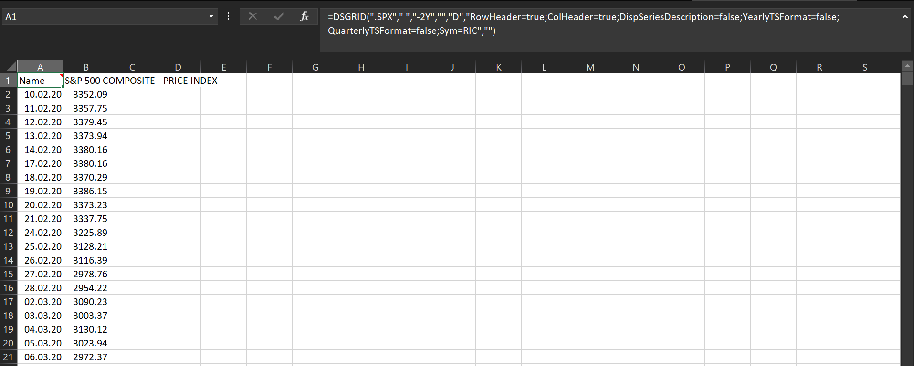

# The Eikon API

## How to get Market past data with Python

In the previous episode, we saw how could we get data from a 'live feed', the Eikon server which sends information constantly. We analyzed two methodologies to accomplish our final goal. In this way, we can (for example) update the valuations of the positions we hold and calculate the key metrics of our portfolio every time an updated market price is retrieved. 

This information is very useful if we are building a system that controls our portfolio and generates insights, information day and night. The data retrieval and calculation can run persistently in the background and we can consult it every time we want using a more or less complex interface: a GUI, a Dashboard, or a Web App. We will discuss this aspect in detail in the section regarding presenting data.

We can choose to send updates every X time or at a given hour every day. We can even set thresholds on some key metrics, and send notifications if those limits are breached. But what about more complex metrics/indicators? 

Every asset manager knows that there is one piece of information that is missing and that is vital to perform a more in-depth analysis: data from the past. This is a fundamental piece we need to be able to run practically any kind of financial application, apart from those which are purely based on the present situation of your portfolio. It is sufficient to think about 3 different, yet widely used indicators/metrics:

- moving averages: a mean of past prices.
- volatility: the standard deviation of past returns.
- maximum drawdown: basically the maximum loss over a time span.

All of them use a series of values taken from a past period: it can be one week, one year, or a custom time frame. No matter the time, we must be able to obtain this information for our applications. This is why today's episode is based on how we can fetch past data using Eikon and its Python API.

## How past data is retrieved in Excel?

As we already saw in the introduction, the Eikon interface for Excel is accessible via an Excel COM Add-in during the Eikon terminal's first installation and it is called Datastream. There are two ways of using the library:

1. Browsing the interface that appears on the Ribbon.
2. Typing formulas directly in one cell.

The first method provides an 'easy' way to find the time series you need. It's called _DFO Navigator_ and it's accessed with the button _Find Series_. Clicking the button a GUI will pop up and you can try to find the instruments you need with some filtered searches.


I wrote easy in quotation marks because I always found the interface legacy and hard to navigate. This is only my opinion but you can judge yourself by looking at the example image below. Nowadays we are used to advanced search bars and engines and I found that this particular one would need a refresh. In the example, I tried to search for the S&P500 and that is what I get as the first attempt, without adding filters. Quite disappointing for a company that earns a quite good amount of money from their clients.


Once the instrument you are searching for is found, the _Time Series Request_ Button will help you create the Data request.


You can directly type the code in the corresponding field or search for it. You can easily customize your request with a lot of options that are accessed directly on the panel, and this is a very nice feature. 

The result is dumped on the excel spreadsheet in the first column. If you submit more requests at the same time more columns will be filled with data.



If you pay attention to the image above, you will see that the add-in created a custom formula in the first cell: ```DSGRID```, with all the options that were specified during the manual request. Useless to say that if you know already the formula you can type it in one cell and you will still get your data. 

I will finish this Excel review by noticing just one thing: imagine we need to update the time series of all the S&P500 components: they are 500. How would you do it with this manual interface? Well, I will not answer the question because I would like you to come to the same conclusion as me: Read the next section.

## How to retrieve past data in Python

Let's go to the fun part now. As you probably know now, all the processes seen in the previous section can be replicated using the Python Eikon API in a very similar way to what we saw for getting the live data: using a method of the API called ```get_timeseries```.

Here is the description of the method

### ```get_timeseries```

#### Structure

```get_timeseries(rics, fields='*', start_date=None, end_date=None, interval='daily', count=None, calendar=None, corax=None normalize=False, raw_output=False, debug=False)```

#### Parameters

| Name | Type | Description | 
|----- |----- | ----------- |
|rics | string or list of strings | Single RIC or list of RICs to retrieve historical data for |
|start_date | string or datetime.datetime or datetime.timedelta | Starting date and time of the historical range. The string format is ```%Y-%m-%dT%H:%M:%S```, for example, ```2016-01-20T15:04:05```. ```datetime.timedelta``` is negative number of day relative to ```datetime.now()```. The default is ```datetime.now() + timedelta(-100)```.|
|end_date | string or datetime.datetime or datetime.timedelta.  |End date and time of the historical range. Possible string formats: ```%Y-%m-%d```, for example, ```2017-01-20 %Y-%m-%dT%H:%M:%S```, for example, ```2017-01-20T15:04:05 datetime.timedelta``` is a negative number of days relative to ```datetime.now()```. The default is ```datetime.now()```.|
interval | string | Data interval. Possible values are ```tick```, ```minute```, ```hour```, ```daily```, ```weekly```, ```monthly```, ```quarterly```, ```yearly```. The default is ```daily```. |
fields | string or list of strings | Use this parameter to filter the returned fields set. Available fields: ```TIMESTAMP```, ```VALUE```, ```VOLUME```, ```HIGH```, ```LOW```, ```OPEN```, ```CLOSE```, ```COUNT```. By default, all fields are returned. |
count | int, optional | Maximum number of data points retrieved. |
calendar | string, optional | Possible values: ```native```, ```tradingdays```, ```calendardays```. |
corax | string, optional | Possible values: ```adjusted```, ```unadjusted```. |
normalize | boolean | If set to True, the function returns a normalized data frame with the following columns: ```Date```, ```Security```, ```Field```. If the value of this parameter is ```False```, the returned data frame shape depends on the number of RICs and the number of fields in the response. There are three different shapes: One RIC and many fields, many RICs and one field, many RICs, and many fields. The default is ```False```|
raw_output | boolean | Set this parameter to ```True``` to get the data in JSON format. If set to ```False```, the function returns a data frame whose shape is defined by the ```normalize``` parameter. The default is ```False```. |
debug | bool | When set to ```True```, the JSON request and response are printed. The default is ```False```. |

#### Raises

**Exception**
 
If request fails or if server returns an error.

**ValueError**

If a parameter type or value is wrong.

as you can see there are a couple of possibilities to format the input start and end date. You can use a string or the more convenient python ```datetime``` module. If you don't know the module I would suggest you read the documentation [here](https://docs.python.org/3/library/datetime.html), you will need practically always. Let's say we want the information for last week. Either of the following should work:


```python
from datetime import datetime,timedelta

# using timedelta module is easy to obtain 
# a past date in datetime format
start_datetime = datetime.now() + timedelta(-7)
end_datetime = datetime.now()
print(f"start datetime: {start_datetime}")
print(f"end datetime: {end_datetime}")

# the strftime module is able to convert
# a datime to a string of a custom format
start_string = start_datetime.strftime("%Y-%m-%dT%H:%M:%S") 
end_string = end_datetime.strftime("%Y-%m-%dT%H:%M:%S") 
print(f"start string: {start_string}")
print(f"end string: {end_string}")

```

    start datetime: 2022-02-09 16:25:58.615021
    end datetime: 2022-02-16 16:25:58.615021
    start string: 2022-02-09T16:25:58
    end string: 2022-02-16T16:25:58
    

I used the ```strftime``` method to convert from datetime to convert from ```datetime``` to ```string```. We can now try to retrieve the actual data using those dates. Let's say we want Microsoft and Apple candles (open, close, high, low). The code will be the following:


```python
import eikon

# connect to the eikon api
eikon.set_app_key('your app key here')

# get candle for a couple of instruments
df = eikon.get_timeseries(["MSFT.O","AAPL.O"], 
                        start_date = start_datetime,
                        end_date = end_datetime, 
                        fields = ["OPEN","CLOSE","HIGH","LOW"],
                        interval="daily")

df
```


<div>
<style scoped>
    .dataframe tbody tr th:only-of-type {
        vertical-align: middle;
    }

    .dataframe tbody tr th {
        vertical-align: top;
    }

    .dataframe thead tr th {
        text-align: left;
    }

    .dataframe thead tr:last-of-type th {
        text-align: right;
    }
</style>
<table border="1" class="dataframe">
  <thead>
    <tr>
      <th>Security</th>
      <th colspan="4" halign="left">MSFT.O</th>
      <th colspan="4" halign="left">AAPL.O</th>
    </tr>
    <tr>
      <th>Field</th>
      <th>OPEN</th>
      <th>CLOSE</th>
      <th>HIGH</th>
      <th>LOW</th>
      <th>OPEN</th>
      <th>CLOSE</th>
      <th>HIGH</th>
      <th>LOW</th>
    </tr>
    <tr>
      <th>Date</th>
      <th></th>
      <th></th>
      <th></th>
      <th></th>
      <th></th>
      <th></th>
      <th></th>
      <th></th>
    </tr>
  </thead>
  <tbody>
    <tr>
      <th>2022-02-10</th>
      <td>304.04</td>
      <td>302.38</td>
      <td>309.12</td>
      <td>300.7</td>
      <td>174.14</td>
      <td>172.12</td>
      <td>175.48</td>
      <td>171.55</td>
    </tr>
    <tr>
      <th>2022-02-11</th>
      <td>303.19</td>
      <td>295.04</td>
      <td>304.29</td>
      <td>294.22</td>
      <td>172.33</td>
      <td>168.64</td>
      <td>173.08</td>
      <td>168.04</td>
    </tr>
    <tr>
      <th>2022-02-14</th>
      <td>293.77</td>
      <td>295.0</td>
      <td>296.76</td>
      <td>291.35</td>
      <td>167.37</td>
      <td>168.88</td>
      <td>169.58</td>
      <td>166.56</td>
    </tr>
    <tr>
      <th>2022-02-15</th>
      <td>300.008</td>
      <td>300.47</td>
      <td>300.8</td>
      <td>297.02</td>
      <td>170.97</td>
      <td>172.79</td>
      <td>172.95</td>
      <td>170.25</td>
    </tr>
    <tr>
      <th>2022-02-16</th>
      <td>298.365</td>
      <td>294.475</td>
      <td>298.66</td>
      <td>293.68</td>
      <td>171.85</td>
      <td>170.655</td>
      <td>172.32</td>
      <td>170.05</td>
    </tr>
  </tbody>
</table>
</div>


Two things to notice:
1. it is a multi-index dataframe 
2. the week-end dates are not taken into account

you can access the single dataframes in this way


```python
df["MSFT.O"]
```


<div>
<style scoped>
    .dataframe tbody tr th:only-of-type {
        vertical-align: middle;
    }

    .dataframe tbody tr th {
        vertical-align: top;
    }

    .dataframe thead th {
        text-align: right;
    }
</style>
<table border="1" class="dataframe">
  <thead>
    <tr style="text-align: right;">
      <th>Field</th>
      <th>OPEN</th>
      <th>CLOSE</th>
      <th>HIGH</th>
      <th>LOW</th>
    </tr>
    <tr>
      <th>Date</th>
      <th></th>
      <th></th>
      <th></th>
      <th></th>
    </tr>
  </thead>
  <tbody>
    <tr>
      <th>2022-02-10</th>
      <td>304.04</td>
      <td>302.38</td>
      <td>309.12</td>
      <td>300.7</td>
    </tr>
    <tr>
      <th>2022-02-11</th>
      <td>303.19</td>
      <td>295.04</td>
      <td>304.29</td>
      <td>294.22</td>
    </tr>
    <tr>
      <th>2022-02-14</th>
      <td>293.77</td>
      <td>295.0</td>
      <td>296.76</td>
      <td>291.35</td>
    </tr>
    <tr>
      <th>2022-02-15</th>
      <td>300.008</td>
      <td>300.47</td>
      <td>300.8</td>
      <td>297.02</td>
    </tr>
    <tr>
      <th>2022-02-16</th>
      <td>298.365</td>
      <td>294.475</td>
      <td>298.66</td>
      <td>293.68</td>
    </tr>
  </tbody>
</table>
</div>


Some other parameters may be interesting. For the interval, you can go until ```tick```


```python
# get candle for a couple of instruments
df = eikon.get_timeseries(["MSFT.O"], 
                        start_date = start_datetime,
                        end_date = end_datetime, 
                        interval="tick")
df
```


<div>
<style scoped>
    .dataframe tbody tr th:only-of-type {
        vertical-align: middle;
    }

    .dataframe tbody tr th {
        vertical-align: top;
    }

    .dataframe thead th {
        text-align: right;
    }
</style>
<table border="1" class="dataframe">
  <thead>
    <tr style="text-align: right;">
      <th>MSFT.O</th>
      <th>VALUE</th>
      <th>VOLUME</th>
    </tr>
    <tr>
      <th>Date</th>
      <th></th>
      <th></th>
    </tr>
  </thead>
  <tbody>
    <tr>
      <th>2022-02-16 15:10:35.721</th>
      <td>294.43</td>
      <td>100</td>
    </tr>
    <tr>
      <th>2022-02-16 15:10:35.721</th>
      <td>294.41</td>
      <td>100</td>
    </tr>
    <tr>
      <th>2022-02-16 15:10:35.721</th>
      <td>294.4</td>
      <td>1</td>
    </tr>
    <tr>
      <th>2022-02-16 15:10:35.721</th>
      <td>294.42</td>
      <td>18</td>
    </tr>
    <tr>
      <th>2022-02-16 15:10:35.721</th>
      <td>294.42</td>
      <td>15</td>
    </tr>
    <tr>
      <th>...</th>
      <td>...</td>
      <td>...</td>
    </tr>
    <tr>
      <th>2022-02-16 15:51:12.656</th>
      <td>294.9</td>
      <td>6</td>
    </tr>
    <tr>
      <th>2022-02-16 15:51:12.656</th>
      <td>294.9</td>
      <td>100</td>
    </tr>
    <tr>
      <th>2022-02-16 15:51:12.663</th>
      <td>294.895</td>
      <td>20</td>
    </tr>
    <tr>
      <th>2022-02-16 15:51:12.694</th>
      <td>294.9</td>
      <td>2</td>
    </tr>
    <tr>
      <th>2022-02-16 15:51:12.755</th>
      <td>294.91</td>
      <td>16</td>
    </tr>
  </tbody>
</table>
<p>50000 rows × 2 columns</p>
</div>


For this only the VALUE and VOLUME fields are present. If you try to query for other fields you will have a DataFrame full of NAs. As you can see, you can easily rump it up to a DataFrame with 50000 rows. The query took 2.5 seconds to run!

You can start playing a bit with the parameters and see what changes, just to have a feeling of how it works to retrieve the data. I promise it will be fun! 🤪

For the moment we saw how to retrieve a stream of data and now you also know how to retrieve past data. Well, I think you are super ready to start building your applications. Once you have the data at hand it's already half of the job. Try to calculate something with the DataFrame you have, like total return or volatility, you will see it's very easy and satisfactory. 

But we're not finished yet. I would like to discuss a couple of more advanced features that you can build in Python, for example how to create a Python Class that will do the job of connecting and retrieving data with yet less effort. What to say: stay with the fellowship! 🧙‍♂️ 
