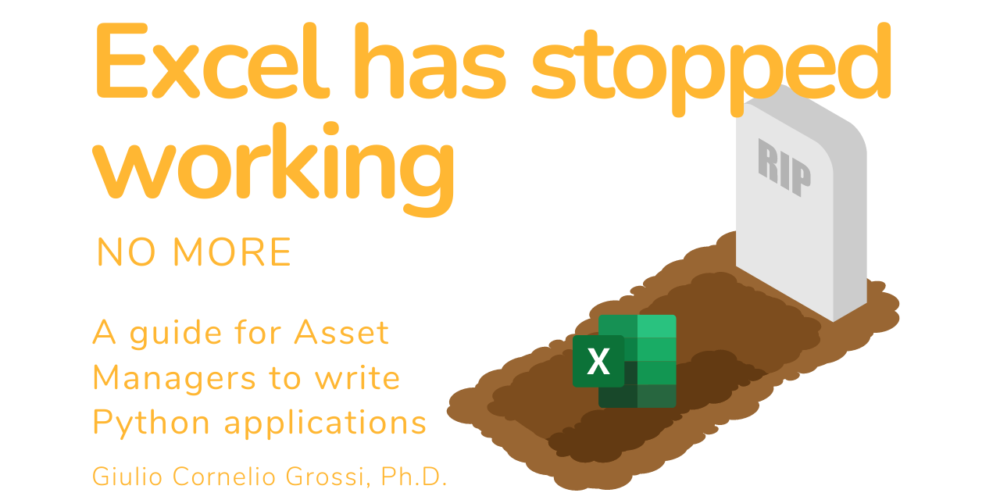

## Table of contents

<a href="https://gcgrossi.github.io/NoMore_Excel_has_stopped_working/Introduction/">👹 Introduction to the nightmare</a>

<a href="https://gcgrossi.github.io/NoMore_Excel_has_stopped_working/Geeting_Data/">🎏 Getting Data</a>
 
 - <a href="https://gcgrossi.github.io/NoMore_Excel_has_stopped_working/Eikonapi_getting_started/">Getting Started with Python Eikon    </a>
 
  - <a href="https://gcgrossi.github.io/NoMore_Excel_has_stopped_working/Eikonapi_stream_data/">Python Eikon. How to get a constant stream of Data</a>

